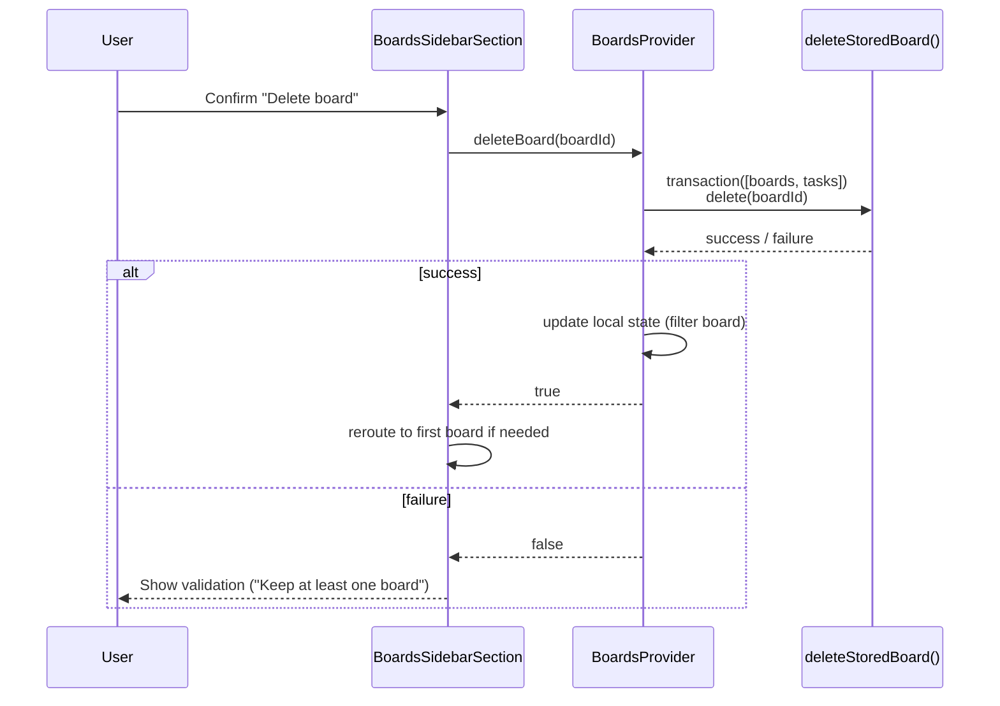

# Sequence — Bulk Operation (Delete Board)

> Assumption: “Bulk operations” map to destructive actions that touch multiple stores at
> once. Deleting a board removes both its metadata and all tasks inside a single IndexedDB
> transaction.

- `deleteStoredBoard` is the only place where both object stores are mutated atomically.
