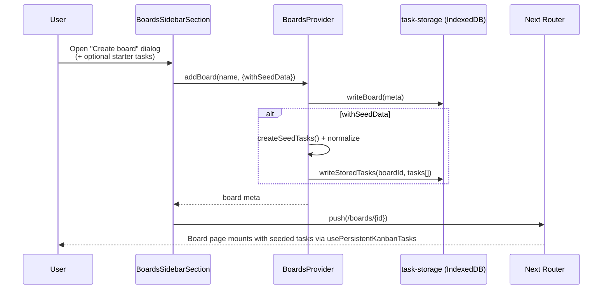

# Sequence — Create Board

```mermaid
sequenceDiagram
    participant U as User
    participant UI as BoardsSidebarSection
    participant Ctx as BoardsProvider
    participant IDB as task-storage (IndexedDB)
    participant Router as Next Router

    U->>UI: Open "Create board" dialog<br/>(+ optional starter tasks)
    UI->>Ctx: addBoard(name, {withSeedData})
    Ctx->>IDB: writeBoard(meta)
    alt withSeedData
        Ctx->>Ctx: createSeedTasks() + normalize
        Ctx->>IDB: writeStoredTasks(boardId, tasks[])
    end
    Ctx-->>UI: board meta
    UI->>Router: push(/boards/{id})
    Router-->>U: Board page mounts with seeded tasks via usePersistentKanbanTasks
```

- `BoardsProvider.addBoard` ensures timestamps + IDs, then optionally seeds data.
- Navigation is client-side; board page rehydrates and loads tasks through IndexedDB.
