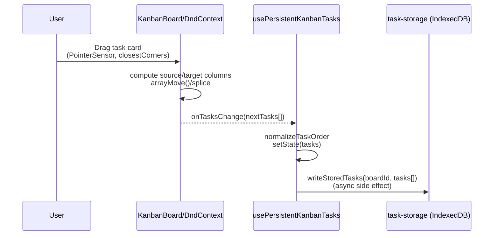

# Sequence — Drag & Drop Move

```mermaid
sequenceDiagram
    participant U as User
    participant DnD as KanbanBoard/DndContext
    participant Hook as usePersistentKanbanTasks
    participant IDB as task-storage (IndexedDB)

    U->>DnD: Drag task card<br/>(PointerSensor, closestCorners)
    DnD->>DnD: compute source/target columns<br/>arrayMove()/splice
    DnD-->>Hook: onTasksChange(nextTasks[])
    Hook->>Hook: normalizeTaskOrder<br/>setState(tasks)
    Hook->>IDB: writeStoredTasks(boardId, tasks[])<br/>(async side effect)
```

- Persistence writes are best-effort; failures are swallowed to keep UI responsive.
- Order is recalculated per column after every drag to keep deterministic stats.
