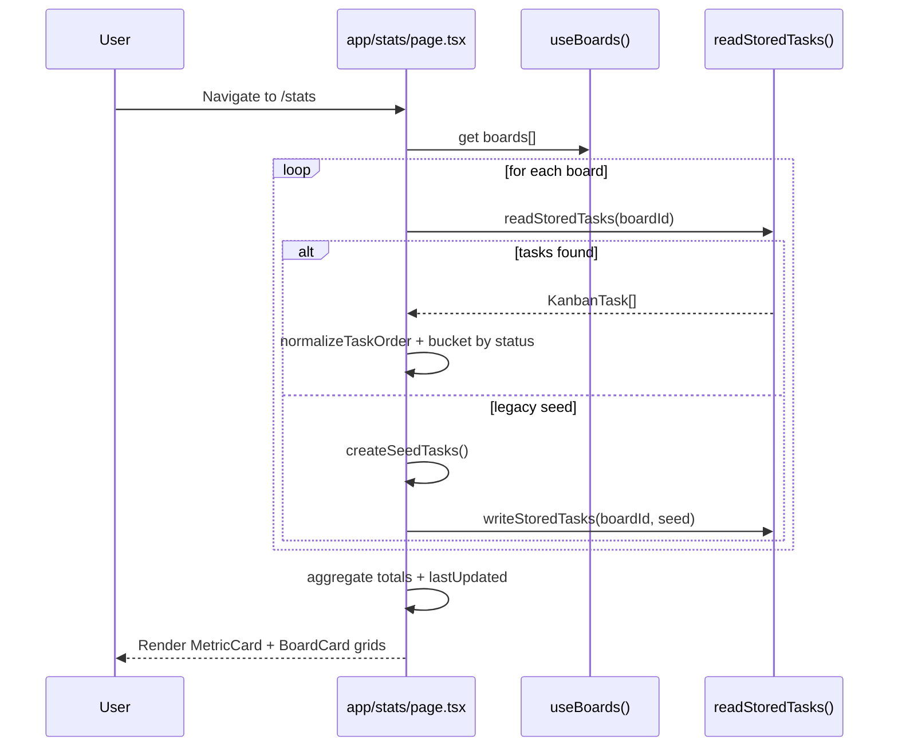

# Sequence — Stats View Load

- The stats route serially iterates boards; latency grows linearly with board count because there is no Promise.all batching.
- Page stay client-side, reusing the same IndexedDB helpers as the board view for consistency.
